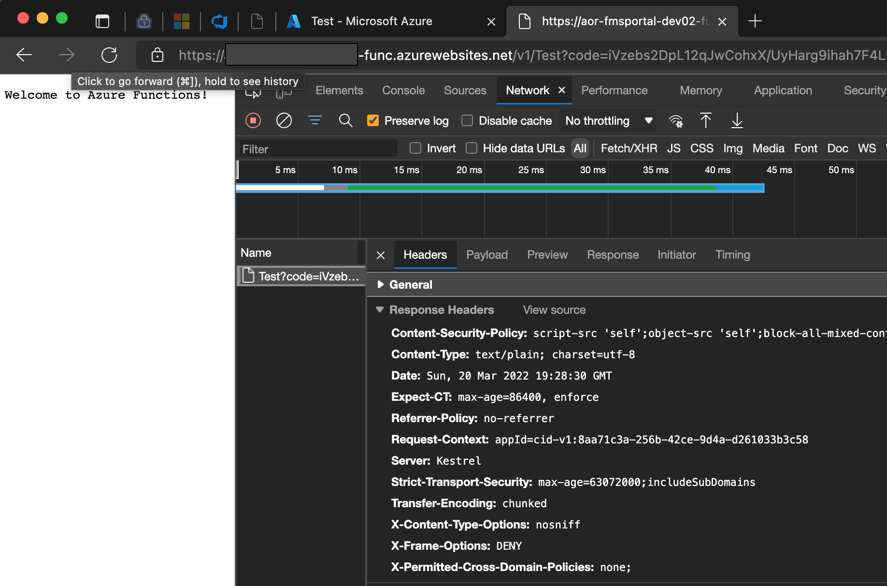

# OwaspHeaders.IsolatedFunction
A .NET Core middleware for injecting the Owasp recommended HTTP Headers into Azure Isolated Functions


## Build and unit tests status
[](https://github.com/mkokabi/OwaspHeaders.IsolatedFunction/actions/workflows/tests.yml)

## License
[](https://opensource.org/licenses/MIT)

## NuGet Package
The nuget package can be accessed [here](https://www.nuget.org/packages/OwaspHeaders.IsolatedFunction/1.1.0)

## Story
### Issue
The Azure Function Isolate is not completely the same as DotNet Core Middleware so the normal solutions won't work.
Therefore, the need came for a project like this.


First of all a big thank to GaProgMan for creating [OwaspHeaders.Core](https://github.com/GaProgMan/OwaspHeaders.Core)
This library is just an extension to his work to support Azure Isolated 
function.

## Usage
```c#
using OwaspHeaders.IsolatedFunction;
public class Program
{
    public static void Main()
    {
      var host = new HostBuilder()
         .ConfigureFunctionsWorkerDefaults(builder =>
         {
            builder.UseMiddleware<OwaspHandlerMiddleware>();
         })
```

## Configuration
Without any configuration the above single line would add following headers:

| Config                             | Output                               |
|------------------------------------|--------------------------------------|
| UseHsts                            | Strict-Transport-Security            |
| UseXFrameOptions                   | X-Frame-Options                      |
| UseXssProtection                   | X-XSS-Protection                     |
| UseXContentTypeOptions             | X-Content-Type-Options               |
| UseContentSecurityPolicyReportOnly | Content-Security-Policy-Report-Only  |
| UseContentSecurityPolicy           | Content-Security-Policy              |
| UseXContentSecurityPolicy          | X-Content-Security-Policy            |
| UseExpectCt                        | Expect-CT                            |
| UseCacheControl                    | Cache-Control                        |

The configuration values are based on the original project, however, because Azure middleware doesn't accept parameter, the
configuration provider should be registered.
```c#
services.AddSingleton<IOwaspMiddlewareConfigurationProvider, CustomConfigurationProviderProvider>();
```
and the configuration provider should be like:
```c#
public class CustomConfigurationProviderProvider : IOwaspMiddlewareConfigurationProvider
{
    public SecureHeadersMiddlewareConfiguration CustomConfiguration()
    {
        return SecureHeadersMiddlewareBuilder
            .CreateBuilder()
            .UseHsts(1200, false)
            .UseXSSProtection(XssMode.oneReport, "https://reporturi.com/some-report-url")
            .UseContentDefaultSecurityPolicy()
            .UseCacheControl(false, maxAge: (int)TimeSpan.FromHours(1).TotalSeconds)
            .UsePermittedCrossDomainPolicies(XPermittedCrossDomainOptionValue.masterOnly)
            .UseReferrerPolicy(ReferrerPolicyOptions.sameOrigin)
            .Build();
    }
}
```
To find the details of `SecureHeadersMiddlewareConfiguration` find the details [here](https://github.com/GaProgMan/OwaspHeaders.Core/blob/master/README.md#configuration)

Follwoing screenshot is from the default configuration.


## Swagger note
Please note that swagger UI would stop with the default configuration. 
It's because Swagger UI is having mixed content. 
So to fix this it needs custom configuarion and mixed content should be allowed:
```c#
.UseContentSecurityPolicy(blockAllMixedContent: false)
```