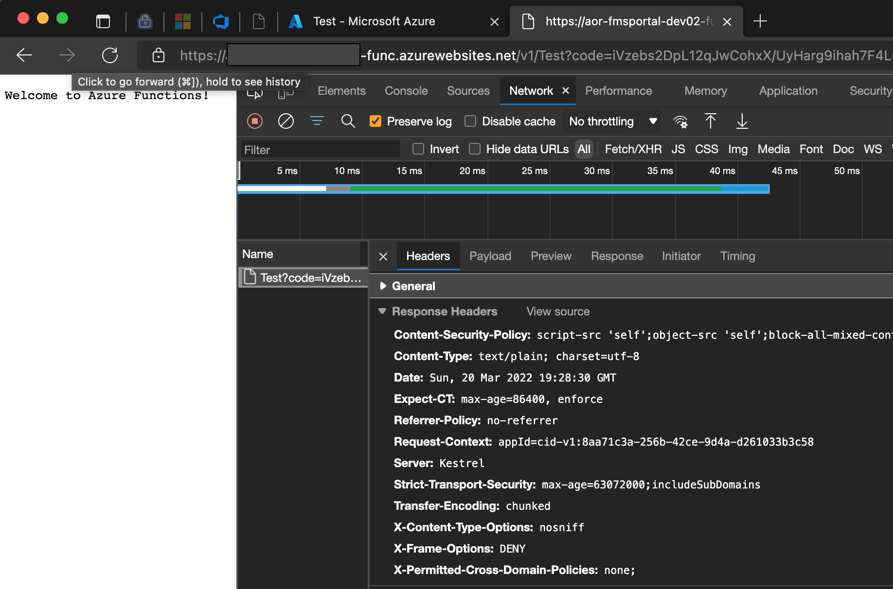

# OwaspHeaders.IsolatedFunction
A .NET Core middleware for injecting the Owasp recommended HTTP Headers into Azure Isolated Functions


## Build and unit tests status
[](https://github.com/mkokabi/OwaspHeaders.IsolatedFunction/actions/workflows/tests.yml)

## NuGet Package
The nuget package can be accessed [here](https://www.nuget.org/packages/OwaspHeaders.IsolatedFunction/1.1.0)

## Story
The first thing is a big thank to GaProgMan for creating [OwaspHeaders.Core](https://github.com/GaProgMan/OwaspHeaders.Core)
This library is just an extension to his work to support Azure Isolated 
function.

## Usage
```c#
IConfigurationRoot _configuration = null;
var host = new HostBuilder()
   .ConfigureFunctionsWorkerDefaults(builder =>
   {
      builder.UseMiddleware<OwaspHandlerMiddleware>();
   })
```

## Configuration
Without any configuration the above single line would add following headers:

| Config                              | Output                               |
|-------------------------------------|--------------------------------------|
| UseHsts                             | Strict-Transport-Security            |
| UseXFrameOptions                    | X-Frame-Options                      |
| UseXssProtection                    | X-XSS-Protection                     |
| UseXContentTypeOptions              | X-Content-Type-Options               |
| UseContentSecurityPolicyReportOnly  | Content-Security-Policy-Report-Only  |
| UseContentSecurityPolicy            | Content-Security-Policy              |
| UseXContentSecurityPolicy           | X-Content-Security-Policy            |
| UseExpectCt                         | Expect-CT                            |


The configuration is based on the original project. 
So please find the coniguration details [here](https://github.com/GaProgMan/OwaspHeaders.Core/blob/master/README.md#configuration)

